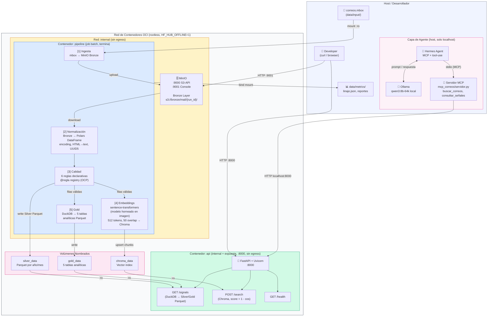
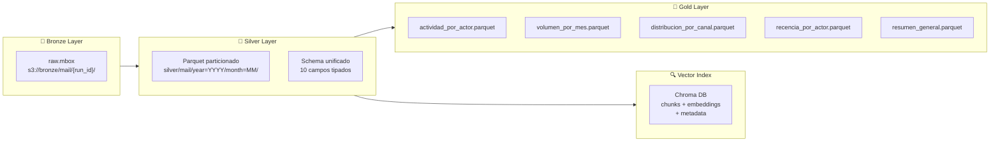

# Infraestructura de Datos Personal - Pipeline de Correo

Convierte un archivo de correos (.mbox) en una base consultable por lenguaje natural, sin que los datos salgan del equipo.

> Pipeline reproducible, conteinerizado y rootless que ingesta correo desde archivos `.mbox`, lo normaliza siguiendo la **arquitectura medallon** (Bronze, Silver, Gold), aplica reglas de calidad declarativas, genera embeddings semanticos e indexa los datos para exponerlos via una API REST local.

**Proyecto académico** · INFB6074 · Universidad Tecnológica Metropolitana (UTEM)

---

## Tabla de Contenidos

- [Características Principales](#características-principales)
- [Stack Tecnológico](#stack-tecnológico)
- [Estructura del Repositorio](#estructura-del-repositorio)
- [Arquitectura del Sistema](#arquitectura-del-sistema)
- [Guía de Instalación](#guía-de-instalación)
  - [Prerrequisitos](#prerrequisitos)
  - [Clonar el Repositorio](#clonar-el-repositorio)
  - [Configurar Variables de Entorno](#configurar-variables-de-entorno)
  - [Preparar Datos de Entrada](#preparar-datos-de-entrada)
  - [Ejecutar con Contenedores](#ejecutar-con-contenedores)
  - [Desarrollo Local sin Contenedores](#desarrollo-local-sin-contenedores)
- [Guía de Reproducibilidad](#guía-de-reproducibilidad)
- [Descripción del Pipeline](#descripción-del-pipeline)
- [Reglas de Calidad](#reglas-de-calidad)
- [API REST](#api-rest)
- [Tests](#tests)
- [Linaje y Observabilidad](#linaje-y-observabilidad)
- [Capa de Agente (MCP + Hermes)](#capa-de-agente-mcp--hermes)
- [Diseño y Decisiones Técnicas](#diseño-y-decisiones-técnicas)

---

## Características Principales

| Característica | Descripción |
|---|---|
| **Arquitectura Medallón** | Separación clara en capas Bronze (raw) → Silver (normalizado) → Gold (analítico) |
| **Reglas de calidad declarativas** | 6 reglas aisladas con patrón registry (`@regla`). Añadir reglas no modifica las existentes |
| **IDs determinísticos** | `signal_id` basado en `uuid5(NAMESPACE_URL, source+raw_id)`. Reproducible entre ejecuciones |
| **Búsqueda semántica** | Embeddings multilingües (`paraphrase-multilingual-MiniLM-L12-v2`) indexados en Chroma |
| **API REST async** | FastAPI + DuckDB para consultas filtradas sobre Parquet; Chroma para búsqueda por similitud |
| **Motor de contenedores neutro** | Compatible con Docker y Podman sin modificaciones. Makefile detecta cuál está disponible |
| **Rootless por diseño** | Sin `sudo`, sin `privileged: true`, sin sockets del motor. Seguro en Podman rootless |
| **Dependencias fijadas** | Todas las dependencias en `requirements.txt` con versiones `==` para reproducibilidad exacta |
| **Linaje de datos** | `linaje.json` generado por ejecución con métricas por etapa (filas, duración, descartes) |
| **Datos sintéticos reproducibles** | Generador con semilla configurable para obtener datos idénticos entre ejecuciones |

---

## Stack Tecnológico

| Capa | Tecnología | Versión |
|---|---|---|
| Lenguaje | Python | 3.12 |
| Procesamiento de datos | Polars + PyArrow | 1.5.0 / 17.0.0 |
| Almacenamiento objeto | MinIO | latest |
| Base de datos vectorial | ChromaDB | 0.5.23 |
| Embeddings | sentence-transformers | 3.3.1 |
| API REST | FastAPI + Uvicorn | 0.115.6 / 0.34.0 |
| Consultas analíticas | DuckDB | 1.1.3 |
| Validación de esquemas | Pydantic | 2.10.4 |
| Parsing HTML | BeautifulSoup4 + lxml | 4.12.3 |
| Configuración | PyYAML | 6.0.2 |
| Testing | pytest + pytest-asyncio | 8.3.4 / 0.24.0 |
| Cliente HTTP (tests) | httpx | 0.28.1 |
| Contenedores | Docker / Podman | OCI-compatible |

---

## Estructura del Repositorio

```
infra-personaldata/
│
├── compose.yml                  # Orquestación OCI-neutral (Docker y Podman)
├── Dockerfile                   # Imagen con modelo de embeddings horneado, usuario no-root (appuser)
├── Makefile                     # Detección automática Docker/Podman
├── requirements.txt             # Dependencias Python con versiones fijadas (==)
├── .env.example                 # Plantilla de variables de entorno (sin secretos)
├── pytest.ini                   # Configuración de pytest (marcadores, modo async)
│
├── catalogo.yaml                # Contrato de datos: esquema de la capa Silver
├── reglas_calidad.yaml          # Contrato de calidad: definición declarativa de reglas
├── generar_datos.py             # Generador de correos sintéticos (RNG con semilla)
│
├── pipeline/                    # Núcleo ETL del pipeline
│   ├── main.py                  # Orquestador: coordina todas las etapas en orden
│   ├── etapas/
│   │   ├── ingesta.py           # Etapa 1: .mbox → MinIO (Bronze)
│   │   ├── normaliza.py         # Etapa 2: Bronze → Polars DataFrame (Silver)
│   │   ├── calidad.py           # Etapa 3: aplica las 6 reglas declarativas
│   │   ├── embeddings.py        # Etapa 4: sentence-transformers → Chroma
│   │   └── gold.py              # Etapa 5: Silver → tablas analíticas (Gold)
│   ├── metadata/
│   │   ├── catalogo.py          # Carga y valida catalogo.yaml con Pydantic
│   │   └── linaje.py            # Escritura thread-safe de linaje.json
│   └── utils/
│       ├── minio_client.py      # Wrapper de MinIO (autenticación por variables de entorno)
│       └── logging_cfg.py       # Logging estructurado en JSON a stdout
│
├── api/                         # Aplicación FastAPI
│   ├── main.py                  # App FastAPI + registro de routers
│   ├── endpoints/
│   │   ├── consulta.py          # GET /signals (DuckDB sobre Parquet Silver/Gold)
│   │   └── busqueda.py          # POST /search (búsqueda semántica via Chroma)
│   └── modelos.py               # Schemas de request/response con Pydantic
│
├── tests/                       # Suite de tests
│   ├── conftest.py              # Fixtures compartidas (builders de mbox, DataFrames)
│   ├── test_normaliza.py        # Normalización: encoding, HTML, IDs determinísticos
│   ├── test_calidad.py          # Aplicación de reglas de calidad
│   ├── test_embeddings.py       # Indexación en Chroma (marcado como `slow`)
│   ├── test_catalogo.py         # Validación del catálogo de datos
│   ├── test_api_busqueda.py     # Endpoint POST /search
│   ├── test_api_consulta.py     # Endpoint GET /signals
│   ├── test_generar_datos.py    # Reproducibilidad del generador sintético
│   └── run_pipeline_test.py     # Test de integración end-to-end
│
└── data/                        # Directorio de datos (no versionado en git)
    ├── input/                   # .mbox de entrada (montado read-only en contenedor)
    ├── silver/                  # Parquet particionados por año/mes
    ├── gold/                    # Tablas analíticas pre-computadas
    ├── chroma/                  # Base de datos vectorial persistente
    └── metrics/                 # Reportes de calidad/Gold y linaje.json (bind mount, persiste en el host)
```

---

## Arquitectura del Sistema



### Flujo de Datos: Capas Medallon



---

## Guía de Instalación

### Prerrequisitos

**Opcion A.** Con contenedores (recomendado):

| Requisito | Versión mínima | Verificación |
|---|---|---|
| Docker Engine + Docker Compose v2 | Docker 24.x | `docker compose version` |
| **o** Podman + Podman Compose | Podman 4.x | `podman --version` |
| Git | cualquier versión reciente | `git --version` |

**Opcion B.** Desarrollo local sin contenedores:

| Requisito | Versión | Verificación |
|---|---|---|
| Python | 3.12.x | `python --version` |
| pip | ≥ 23 | `pip --version` |
| MinIO Server | latest | `minio --version` |

> El proyecto **no requiere sudo** en ninguna de las opciones.

---

### Clonar el Repositorio

```bash
git clone https://github.com/<usuario>/infra-personaldata.git
cd infra-personaldata
```

---

### Configurar Variables de Entorno

```bash
cp .env.example .env
```

El archivo `.env.example` contiene valores por defecto funcionales. Solo es necesario modificarlos para entornos personalizados:

```dotenv
# ─── MinIO (almacenamiento Bronze) ─────────────────────────────────────────
MINIO_ENDPOINT=minio:9000          # Dirección del servicio MinIO
MINIO_ACCESS_KEY=minioadmin        # Usuario de acceso
MINIO_SECRET_KEY=minioadmin        # Contraseña (cambiar en producción)
MINIO_BUCKET_BRONZE=bronze         # Nombre del bucket Bronze
MINIO_SECURE=false                 # TLS: false para entorno local

# ─── Rutas de datos (rutas dentro del contenedor) ──────────────────────────
MBOX_PATH=/app/data/input/correos.mbox
SILVER_PATH=/app/data/silver
GOLD_PATH=/app/data/gold
CHROMA_PATH=/app/data/chroma
METRICS_PATH=/app/data/metrics
LINAJE_PATH=/app/data/metrics/linaje.json

# ─── Embeddings ─────────────────────────────────────────────────────────────
EMBEDDING_MODEL=paraphrase-multilingual-MiniLM-L12-v2
EMBEDDING_BATCH_SIZE=32            # Reducir a 16 si hay limitaciones de RAM

# ─── API ─────────────────────────────────────────────────────────────────────
API_HOST=0.0.0.0
API_PORT=8000

# ─── Logging ─────────────────────────────────────────────────────────────────
LOG_LEVEL=INFO                     # DEBUG | INFO | WARNING | ERROR
```

---

### Preparar Datos de Entrada

**Opcion A.** Usar correos reales:

```bash
mkdir -p data/input
cp /ruta/a/tu/archivo.mbox data/input/correos.mbox
```

**Opcion B.** Generar datos sinteticos reproducibles:

```bash
# Instalar dependencias mínimas (solo para el generador)
pip install -r requirements.txt

# Generar 500 correos con semilla fija (siempre produce el mismo resultado)
python generar_datos.py --semilla 42 --n 500 --salida data/input/correos.mbox
```

> La semilla `42` es la semilla de referencia de este proyecto. Todos los tests y la guía de reproducibilidad usan esta semilla.

---

### Ejecutar con Contenedores

**Con Makefile (detección automática de Docker/Podman):**

```bash
# Construir imágenes y levantar todos los servicios
make up

# Ver logs en tiempo real
make logs

# Ejecutar tests dentro del contenedor
make test

# Detener y limpiar volúmenes
make down
```

**Con Docker Compose directamente:**

```bash
# Construir y levantar
docker compose -f compose.yml up --build

# Solo reconstruir la imagen
docker compose -f compose.yml build --no-cache

# Ver logs de un servicio específico
docker compose -f compose.yml logs -f pipeline
docker compose -f compose.yml logs -f api

# Detener
docker compose -f compose.yml down -v
```

**Con Podman Compose directamente:**

```bash
podman compose -f compose.yml up --build
podman compose -f compose.yml down -v
```

Cuando el pipeline finalice, la API estará disponible en:

- **API REST:** `http://localhost:8000`
- **Documentación interactiva (Swagger):** `http://localhost:8000/docs`
- **MinIO Console:** `http://localhost:9001` (usuario: `minioadmin`, contraseña: `minioadmin`)

---

### Desarrollo Local sin Contenedores

Si se prefiere ejecutar el pipeline directamente en Python:

```bash
# 1. Crear entorno virtual
python -m venv .venv

# Windows (PowerShell)
.venv\Scripts\Activate.ps1

# Linux / macOS
source .venv/bin/activate

# 2. Instalar dependencias
pip install -r requirements.txt

# 3. Levantar MinIO localmente (necesario para la ingesta)
#    En una terminal separada:
minio server ./data/minio-storage --console-address ":9001"

# 4. Ajustar .env para apuntar a MinIO local
#    Cambiar: MINIO_ENDPOINT=localhost:9000

# 5. Generar datos (si no se tienen correos reales)
python generar_datos.py --semilla 42 --n 500 --salida data/input/correos.mbox

# 6. Ejecutar el pipeline completo
python -m pipeline.main

# 7. Levantar la API
uvicorn api.main:app --host 0.0.0.0 --port 8000 --reload

# 8. Ejecutar tests
python -m pytest tests/ -v

# Tests rápidos (sin descarga del modelo de embeddings)
python -m pytest tests/ -v -m "not slow"
```

---

## Guía de Reproducibilidad

Esta guía permite a cualquier desarrollador obtener **exactamente los mismos resultados** partiendo desde cero.

### Paso 1. Clonar y verificar la version exacta

```bash
git clone https://github.com/<usuario>/infra-personaldata.git
cd infra-personaldata

# Verificar que estás en el commit correcto
git log --oneline -5
```

### Paso 2. Preparar el entorno

```bash
# Copiar variables de entorno (no modificar los valores para reproducibilidad exacta)
cp .env.example .env

# Crear directorio de entrada
mkdir -p data/input
```

### Paso 3. Generar el dataset de referencia

El dataset sintético de referencia se genera con la semilla `42` y `500` correos:

```bash
# Con Python local
python generar_datos.py --semilla 42 --n 500 --salida data/input/correos.mbox

# Verificar que se generó correctamente
python -c "
import mailbox
mbox = mailbox.mbox('data/input/correos.mbox')
msgs = list(mbox)
print(f'Mensajes generados: {len(msgs)}')
print(f'Primer Message-ID: {msgs[0][\"Message-ID\"]}')
"
# Salida esperada:
# Mensajes generados: 500
# Primer Message-ID: <msg-001-...@synthetic.local>
```

### Paso 4. Ejecutar el pipeline completo

```bash
# Construir imágenes (primera vez: descarga el modelo de embeddings ~400MB)
docker compose -f compose.yml build --no-cache

# Levantar todos los servicios
docker compose -f compose.yml up
```

El pipeline imprime logs estructurados en JSON. La ejecución completa toma aproximadamente:
- Ingesta: < 5 segundos
- Normalización + Calidad: < 10 segundos
- Embeddings: 1-5 minutos (según CPU)
- Gold: < 10 segundos

### Paso 5. Verificar los artefactos generados

```bash
# Verificar Silver (Parquet)
python -c "
import polars as pl, glob
files = glob.glob('data/silver/**/*.parquet', recursive=True)
df = pl.read_parquet(files)
print(f'Filas en Silver: {len(df)}')
print(f'Columnas: {df.columns}')
print(df.head(2))
"

# Verificar Gold
python -c "
import polars as pl
df = pl.read_parquet('data/gold/resumen_general.parquet')
print(df)
"

# Verificar linaje
python -c "
import json
with open('data/metrics/linaje.json') as f:
    linaje = json.load(f)
print(f'run_id: {linaje[\"ingest_run_id\"]}')
for etapa in linaje['etapas']:
    print(f'  {etapa[\"etapa\"]}: {etapa[\"filas_escritas\"]} filas en {etapa[\"duracion_s\"]:.2f}s')
"
```

**Valores de referencia esperados** (semilla 42, 500 correos):

| Etapa | Filas leídas | Filas escritas |
|---|---|---|
| ingesta | 500 | 500 |
| normaliza | 500 | ~497–500 |
| calidad | ~497–500 | ~490–497 |
| embeddings | - | ~900-1100 chunks |
| gold | - | 5 tablas |

> El rango en normalizacion/calidad se debe al muestreo aleatorio de errores sinteticos. El `signal_id` de cada fila es **deterministico**: mismo `.mbox` produce el mismo `signal_id`.

**Nota sobre los dos datasets del proyecto.** La tabla anterior corresponde al dataset sintetico (semilla 42, 500 correos) que cualquier persona puede regenerar para validar el pipeline sin necesidad de datos propios. La validacion completa del proyecto se realizo ademas sobre un mbox real de 3.369 correos, produciendo 3.355 filas en Silver (descarte r03: 2, r04: 12, tasa 0,42 %), 5 tablas Gold y 6.437 documentos en Chroma. Esos resultados se verificaron durante el desarrollo (rama `fixes-revision`) pero no estan commiteados como artefacto porque `data/` no se versiona. El benchmark del agente local (`docs/benchmark_agente_local.md`) se corrio por separado sobre un dataset sintetico reducido de 9 senales.

### Paso 6. Verificar la API

```bash
# Health check
curl -s http://localhost:8000/health | python -m json.tool
# Esperado: {"status": "ok"}

# Consulta básica (primeros 5 registros)
curl -s "http://localhost:8000/signals?limit=5" | python -m json.tool

# Búsqueda semántica
curl -s -X POST http://localhost:8000/search \
  -H "Content-Type: application/json" \
  -d '{"query": "reunión proyecto", "top_k": 3}' | python -m json.tool
```

### Paso 7. Ejecutar los tests

```bash
# Tests rapidos (sin modelo de embeddings, deben completarse en < 30 segundos)
docker compose -f compose.yml run --rm pipeline \
  python -m pytest tests/ -v -m "not slow"

# Suite completa (incluye descarga y uso del modelo)
docker compose -f compose.yml run --rm pipeline \
  python -m pytest tests/ -v

# Localmente (con venv activo)
python -m pytest tests/ -v -m "not slow"
```

**Resultado esperado:** todos los tests pasan (`PASSED`). Los tests marcados como `slow` requieren que el modelo de embeddings esté descargado.

### Paso 8. Limpiar el entorno

```bash
# Detener servicios y eliminar volúmenes (limpieza completa)
docker compose -f compose.yml down -v

# Eliminar datos generados localmente
rm -rf data/silver data/gold data/chroma data/metrics
```

Para una nueva ejecución reproducible, repetir desde el Paso 4.

---

## Descripción del Pipeline

El orquestador `pipeline/main.py` ejecuta las siguientes etapas en orden estricto:

```
[1] Ingesta ──────── Lee .mbox local → sube a MinIO (Bronze)
       ↓
[2] Normalización ── Descarga de MinIO → parsea emails → esquema unificado
       ↓               (multi-encoding, HTML→plaintext, UUID5 determinístico)
[3] Calidad ───────── Aplica 6 reglas → filtra filas inválidas → reporte
       ↓
[4] Embeddings ───── Chunking (512 tokens, overlap 50) → encode → Chroma upsert
       ↓
[5] Gold ──────────── DuckDB sobre Silver → 5 tablas analíticas → Parquet
       ↓
    linaje.json ───── run_id, timestamps, métricas por etapa (thread-safe)
```

---

## Reglas de Calidad

Las reglas están definidas en `reglas_calidad.yaml` e implementadas con el patrón registry (`@regla`) en `pipeline/etapas/calidad.py`. Agregar una nueva regla **no requiere modificar las existentes**.

| ID | Campo | Descripción | Implementación |
|---|---|---|---|
| `r01` | `actor` | Formato de email RFC 5322 simplificado | Regex: `^[a-zA-Z0-9._%+\-]+@[a-zA-Z0-9.\-]+\.[a-zA-Z]{2,}$` |
| `r02` | `timestamp` | No nulo, no futuro (> now+1d), ≥ 2000-01-01 | Validación datetime con pytz |
| `r03` | `content_text` | Longitud > 10 caracteres tras `strip()` | `len(text.strip()) > 10` |
| `r04` | `raw_id` | Único dentro del run (sin Message-ID duplicados) | `COUNT DISTINCT` sobre el DataFrame |
| `r05` | `content_text` | UTF-8 válido tras decodificación | Detección de bytes inválidos |
| `r06` | `signal_id` | Debe ser `uuid5(NAMESPACE_URL, source + raw_id)` | Recalculo y comparación |

Los registros que no pasan alguna regla se **descartan** del flujo Silver. Los conteos de descarte por regla se registran en `linaje.json` y en `data/metrics/reporte_calidad.json`.

---

## API REST

**Base URL:** `http://localhost:8000`
**Documentación interactiva:** `http://localhost:8000/docs`

### `GET /health`

```bash
curl http://localhost:8000/health
# {"status": "ok"}
```

### `GET /signals`. Consulta filtrada sobre Silver/Gold

```bash
# Primeros 50 registros
curl http://localhost:8000/signals

# Filtrar por actor
curl "http://localhost:8000/signals?actor=usuario@example.com"

# Filtrar por rango de tiempo y limitar resultados
curl "http://localhost:8000/signals?from_ts=2024-01-01T00:00:00Z&to_ts=2024-12-31T23:59:59Z&limit=10"

# Paginación
curl "http://localhost:8000/signals?limit=50&offset=100"
```

| Parámetro | Tipo | Default | Descripción |
|---|---|---|---|
| `source` | string | - | Filtrar por fuente |
| `actor` | string | - | Email exacto del remitente |
| `from_ts` | datetime ISO-8601 | - | Inicio del rango temporal |
| `to_ts` | datetime ISO-8601 | - | Fin del rango temporal |
| `limit` | int (1-500) | 50 | Máximo de resultados |
| `offset` | int | 0 | Desplazamiento para paginación |

### `POST /search`. Busqueda semantica

```bash
curl -X POST http://localhost:8000/search \
  -H "Content-Type: application/json" \
  -d '{"query": "reunión planificación proyecto", "top_k": 5}'

# Con filtro de fuente
curl -X POST http://localhost:8000/search \
  -H "Content-Type: application/json" \
  -d '{"query": "factura servidor", "top_k": 3, "source": "mail"}'
```

| Campo | Tipo | Default | Descripción |
|---|---|---|---|
| `query` | string | requerido | Texto libre en lenguaje natural |
| `top_k` | int (1-100) | 10 | Número de resultados |
| `source` | string | - | Filtro de metadata en Chroma |

La respuesta incluye `score`, calculado como `1.0 - distancia_coseno` (equivalente a la similitud coseno). 1.0 indica coincidencia exacta y 0.0 ausencia de relacion. Con el modelo `paraphrase-multilingual-MiniLM-L12-v2` los valores caen en la practica en el rango [0, 1].

---

## Tests

```bash
# Suite completa
python -m pytest tests/ -v

# Solo tests rápidos (sin modelo de embeddings)
python -m pytest tests/ -v -m "not slow"

# Un módulo específico
python -m pytest tests/test_calidad.py -v

# Dentro del contenedor
make test
```

| Módulo | Qué testea |
|---|---|
| `test_normaliza.py` | Encoding multi-charset, HTML→texto, IDs determinísticos |
| `test_calidad.py` | Aplicación de las 6 reglas, conteo de descartes |
| `test_embeddings.py` | Generación de chunks, indexación en Chroma (`slow`) |
| `test_catalogo.py` | Validación del esquema Pydantic contra `catalogo.yaml` |
| `test_api_consulta.py` | Endpoint `GET /signals`, filtros, paginación |
| `test_api_busqueda.py` | Endpoint `POST /search`, similitud semántica |
| `test_generar_datos.py` | Reproducibilidad del generador (misma semilla → mismo output) |
| `run_pipeline_test.py` | Integración end-to-end con `.mbox` de prueba |

---

## Linaje y Observabilidad

Cada ejecución del pipeline genera `data/metrics/linaje.json` (bind mount: persiste en el host tras la corrida):

```json
{
  "ingest_run_id": "550e8400-e29b-41d4-a716-446655440000",
  "started_at": "2024-06-15T10:30:00+00:00",
  "finished_at": "2024-06-15T10:35:42+00:00",
  "etapas": [
    {
      "etapa": "ingesta",
      "input": "/app/data/input/correos.mbox",
      "output": "s3://bronze/mail/550e8400.../raw.mbox",
      "filas_leidas": 500,
      "filas_escritas": 500,
      "duracion_s": 1.23
    },
    {
      "etapa": "normaliza",
      "filas_leidas": 500,
      "filas_escritas": 497,
      "duracion_s": 4.56,
      "descartadas_por_regla": {
        "r01_actor_email_valido": 2,
        "r02_timestamp_valido": 1
      }
    }
  ]
}
```

**Reportes adicionales:**
- `data/metrics/reporte_calidad.json`: detalle de la etapa de calidad.
- `data/metrics/reporte_gold.json`: validacion de salud de las tablas Gold.

**Logging estructurado** (JSON a stdout, un objeto por línea):
```json
{"timestamp": "2024-06-15T10:30:01Z", "level": "INFO", "logger": "pipeline.ingesta", "message": "Ingesta completada: 500 mensajes en 1.23s"}
```

---

## Capa de Agente (MCP + Hermes)

La infraestructura puede actuar como sustrato de un agente de IA. El directorio
`mcp_correos/` contiene un servidor Model Context Protocol que expone dos tools
(`buscar_correos` y `consultar_senales`) como adaptador delgado sobre la API
REST, y la guia completa para conectar Hermes Agent en modo local (Ollama, sin
egress del agente) o nube (Gemini, con egress documentado).

- Guia de instalacion y configuracion: `mcp_correos/README.md`
- Metodologia y resultados del benchmark del agente local:
  `docs/benchmark_agente_local.md`
- Guia para agentes (se carga al prompt desde el cwd): `AGENTS.md`

Resultado resumido (qwen3:8b-64k en un MacBook M4 de 16 GB): el agente invoca
las tools del MCP de forma confiable, cita fuentes verificables y admite cuando
no hay resultados, con una latencia media de 78.4 s por consulta en caliente.

---

## Diseño y Decisiones Técnicas

| Decisión | Justificación |
|---|---|
| **Patrón registry `@regla`** | Añadir reglas de calidad no modifica código existente. Cerrado a modificación, abierto a extensión |
| **`uuid5` para `signal_id`** | Idempotencia: mismo correo → mismo ID. Permite re-ejecuciones sin duplicados |
| **Polars + Parquet** | Columnar, eficiente en memoria, particionamiento nativo por año/mes |
| **DuckDB para consultas** | Lee Parquet directamente sin servidor. Ideal para análisis ad-hoc sobre la capa Silver/Gold |
| **Chunking con overlap** | Textos largos se dividen en chunks de 512 tokens con 50 tokens de solapamiento para no perder contexto en los límites |
| **Red `internal` sin egress** | MinIO y el pipeline corren SOLO en la red `internal: true`: no pueden hacer conexiones salientes. La API se une ademas a una red `expuesta` porque en podman rootless (macOS) una red interna no permite reenviar el puerto 8000 al host; la API no realiza conexiones salientes en runtime. El modelo de embeddings viene horneado en la imagen y `HF_HUB_OFFLINE=1` garantiza que en runtime nunca se consulta huggingface.co |
| **`appuser` UID 1000** | Sin root en contenedor. Compatible con Podman rootless y entornos con restricciones de seguridad |
| **`threading.Lock` en linaje** | `LinajeWriter` es seguro para uso desde múltiples threads o etapas concurrentes |
| **Versiones `==` en requirements** | Reproducibilidad exacta. `pip install -r requirements.txt` siempre instala el mismo grafo de dependencias |

---

## Restricciones y Consideraciones

- **No hay datos reales en el repositorio.** El directorio `data/` no está versionado en git. Los tests usan únicamente fixtures sintéticas.
- **El modelo de embeddings se descarga durante el `build`** (~470 MB) y queda horneado en la imagen (`/opt/hf-cache`). El build requiere internet; el **runtime es 100% offline** (`HF_HUB_OFFLINE=1`, `TRANSFORMERS_OFFLINE=1`; MinIO y el pipeline corren solo en la red `internal: true`, y la API suma una red `expuesta` unicamente para publicar el puerto 8000 en podman rootless).
- **Verificación de no-egress** (los puertos publicados siguen funcionando en Podman rootless sobre la red interna):

  ```bash
  # Desde el contenedor api: la conexion saliente debe FALLAR
  docker compose -f compose.yml exec api python -c \
    "import socket; s=socket.socket(); s.settimeout(5); s.connect(('1.1.1.1',443))"
  # Esperado: OSError: [Errno 101] Network is unreachable

  # La API sigue accesible desde el host por el puerto publicado
  curl http://localhost:8000/health
  # Esperado: {"status":"ok"}
  ```

  > Limitación conocida: en Podman 4.9, aardvark-dns aún reenvía consultas DNS
  > al host desde redes internas (resolver nombres externos funciona, pero todo
  > tráfico TCP/UDP saliente está bloqueado). Versiones más nuevas de netavark
  > bloquean también el DNS upstream en redes `internal`.
- **Desarrollo en Windows** requiere Docker Desktop o Podman Desktop con soporte WSL2.
- **La semilla del generador** (`--semilla 42`) controla el RNG. Cambiarla produce un dataset diferente, aunque las reglas de calidad y los IDs siguen siendo determinísticos.
